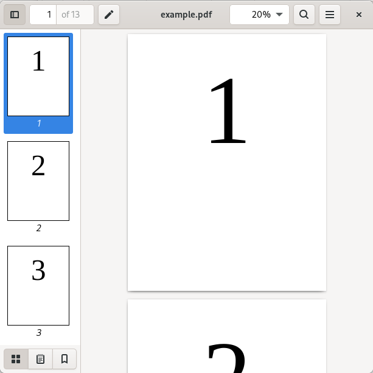
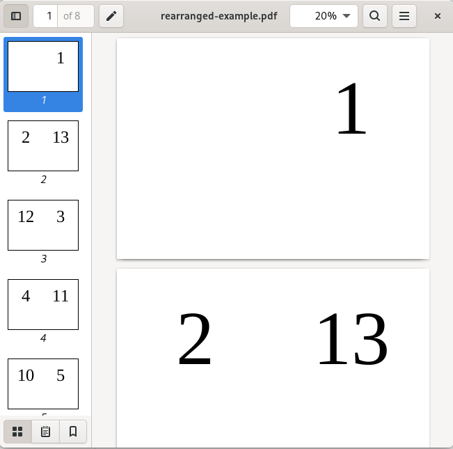

# Rearrange-PDF
Re-arranging A4 pages in a given PDF so you can print them as a A5 book easily

<b>This is is a Linux bash script to re-arrange PDF so it can printed.</b> You will need pdftk and pdfjam tools installed to have this running properly.

Script usage:
```console
Rearrange-PDF.sh [PDFFILE]
```

It then creates a new PDF ready for printing but you will need to print with page flip set to short side option.

Example output of the script:
```console
REARRANGE-PDF
Processing file: ./example/example.pdf
┏━━━━━
┣ number of pages: 13
┣ adding blank pages ... done
┣ rearranging and exporting rearranged-example.pdf ... done
┻
```
And to illustrate what is does graphically:<br>
<u>Input PDF:</u><br>

<br>
<u>Output PDF:</u><br>

<br>
So then if you fold and stack the pages together you will have a A5 book.